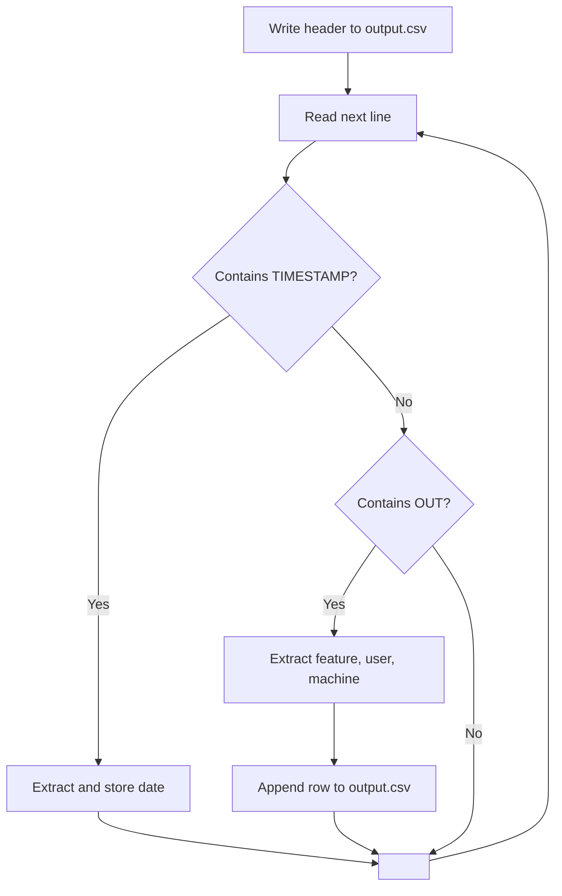

After learning the basics from YouTube, let's build our first `Bash` script.

Download the `.log` file attached in this repo and let's understand it. It's a SolidWorks license log file, the kind that sits on a license server (you don't need to know anything about the server itself). I used Claude to generate the sample log file.

## Scope

Extract the date, license feature, user, and machine name (the users who fetched the license) and convert the data into a `.csv` file.

## Understanding the log file

We only care about a few things, so let's break the file down.

- `06:00:15 (sw_d) TIMESTAMP 08/20 06:00:15` — any line containing `TIMESTAMP` gives us the date. The same date appears multiple times, but the data is in chronological order, so nothing is missing.
- `06:02:50 (sw_d) OUT: "SolidWorks_Visualize_Professional" vsingh@WKS-036 (v1.7) (sw-lic-srv01/27000 400), start 06:02:50` — any line containing `OUT` means a user successfully fetched a license.

Breaking that `OUT` line down further:

- `SolidWorks_Visualize_Professional` — the license feature
- `vsingh` — the user who fetched the license
- `WKS-036` — the machine the license was fetched from

Notice the `OUT` line has no **date** only a time. We have to carry the date forward from the most recent `TIMESTAMP` line.

Bash has no concept of a CSV file, it just writes text. You create a file named `output.csv` and append comma-separated lines to it, like `08/20,solidworks_f,user1,machine1`. The extension is a convention; the file is plain text either way. (Which also means if a field ever contains a comma, the row breaks, not a problem with this log, but worth knowing.)

## Breaking down the problem

## Concepts you'll need

- `echo`
- `awk`
- `while` and `read` — reading a file line by line instead of loading it into memory
- Regex — for pulling the user and machine out of the `OUT` line (awk can do this too)
